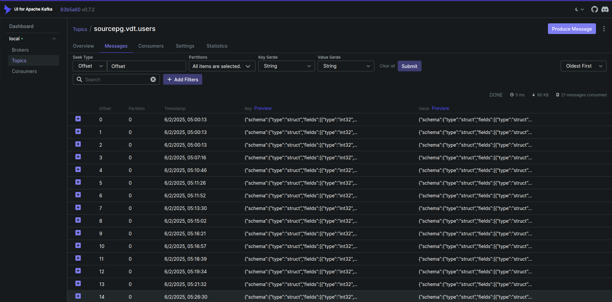
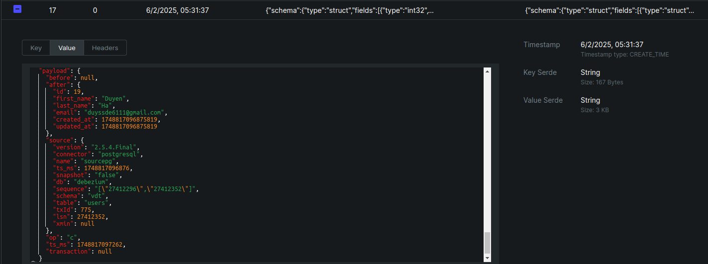
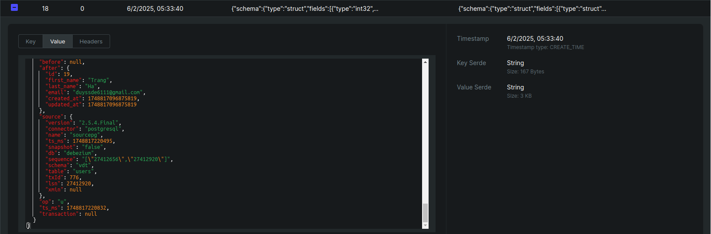
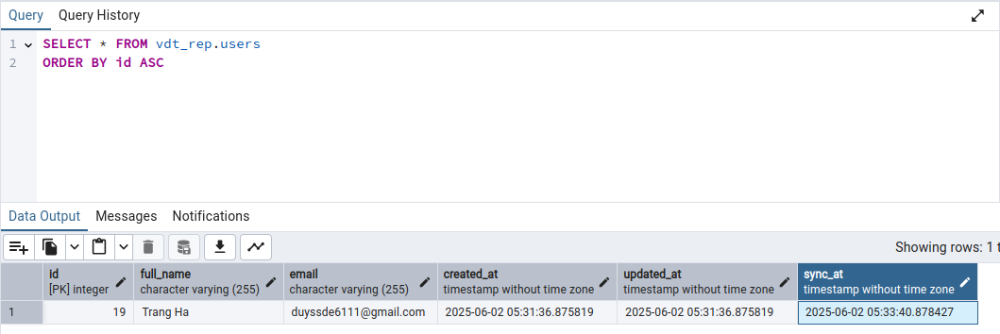

# PostgreSQL Database Synchronization with Kafka & Debezium

## Overview
This project demonstrates real-time database synchronization between two PostgreSQL databases using Kafka and Debezium, with automated data transformation. The system captures changes from a source PostgreSQL database and replicates them to a target database while combining `first_name` and `last_name` fields into a `full_name` field.

## Architecture

### Components
- **Source PostgreSQL**: Primary database where original data resides
- **Debezium**: Captures change data from source PostgreSQL
- **Apache Kafka**: Message broker for change events
- **Kafka Connect**: Manages connectors for data streaming
- **Target PostgreSQL**: Destination database with transformed data

### Data Flow
1. Changes made to source PostgreSQL
2. Debezium captures changes via PostgreSQL WAL
3. Changes are published to Kafka topics
4. Kafka Connect sink processes and transforms the data
5. Transformed data is written to target PostgreSQL

## Prerequisites
- Docker & Docker Compose
- cURL
- Free ports for:
  - Kafka (9092)
  - Kafka Connect (8083)
  - PostgreSQL source (5432)
  - PostgreSQL target (5433)

## Quick Start

### 1. Start Services
Launch all required containers:
```bash
docker compose up -d
```

### 2. Configure Source Connector
Deploy the Debezium PostgreSQL source connector:
```bash
curl -X POST
-H "Accept:application/json"
-H "Content-Type:application/json"
--data @config/postgresql/postgres-source.json
http://localhost:8083/connectors
```

List all connectors
```bash
curl -X GET http://localhost:8083/connectors/
```
Check specific connector status
```bash
curl -X GET http://localhost:8083/connectors/{connector-name}/status
```

### 3. Run Python program
```bash
python src/transform/concat_name.py
```

## Demo

Kafka UI displays changes in the source database



### Insert a new user

In PostgreSQL, execute the following query to insert a new user into the `vdt` schema:
```sql
INSERT INTO vdt.users(first_name, last_name, email)
VALUES ('Duyen', 'Ha', 'duyssde6111@gmail.com');
```

A new message with operation = 'c' (create) is created in Kafka:



### Update First Name to 'Trang'
```sql
UPDATE vdt.users
SET first_name ='Trang'
WHERE id = 19;
```
A new message with operation = 'u' (update) is created in Kafka:


### Output
